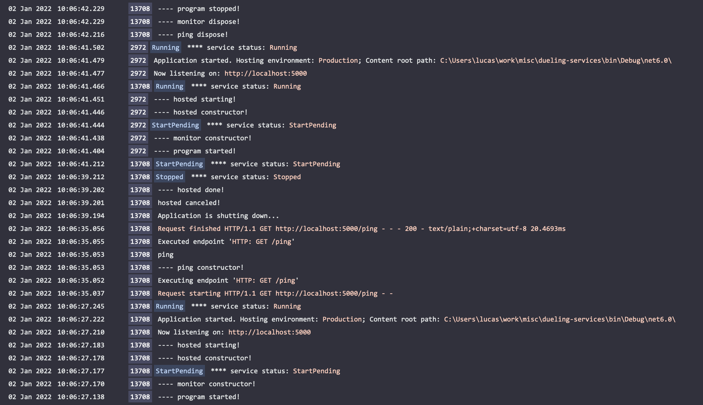

# dueling-services

Repro for singleton disposal issue when aspnetcore windows service hosting

## issue

when hosted as a windows service the aspnetcore application reports the `status` as Stopped before all registered singletons are disposed.

## steps

1. build the solution -> resulting in the executable binary `Lastly.exe`
1. register the exe as a windows service using `sc.exe create Lastly binPath= {path-to-lastly.exe}`
1. install [seq](https://datalust.co/download) for view aggregated logs. or monitor the `log***.txt` files in the executable directory.
1. start the service (via TaskManager)
1. hit the webapi endpoint by visiting `http://localhost:5000/ping`.
1. `Restart` the window service (via TaskManager)
1. view logs

## observed behavior

looking at the logs:

```
{"@t":"2022-01-02T09:06:27.1388452Z","@mt":"---- program started!","ProcessId":13708,"ProcessName":"Lastly"}
{"@t":"2022-01-02T09:06:27.1707978Z","@mt":"---- monitor constructor!","ProcessId":13708,"ProcessName":"Lastly"}
{"@t":"2022-01-02T09:06:27.1771213Z","@mt":"**** service status: {status}","status":"StartPending","ProcessId":13708,"ProcessName":"Lastly"}
{"@t":"2022-01-02T09:06:27.1789896Z","@mt":"---- hosted constructor!","ProcessId":13708,"ProcessName":"Lastly"}
{"@t":"2022-01-02T09:06:27.1835385Z","@mt":"---- hosted starting!","ProcessId":13708,"ProcessName":"Lastly"}
{"@t":"2022-01-02T09:06:27.2103258Z","@mt":"Now listening on: {address}","address":"http://localhost:5000","EventId":{"Id":14,"Name":"ListeningOnAddress"},"SourceContext":"Microsoft.Hosting.Lifetime","ProcessId":13708,"ProcessName":"Lastly"}
{"@t":"2022-01-02T09:06:27.2450011Z","@mt":"**** service status: {status}","status":"Running","ProcessId":13708,"ProcessName":"Lastly"}
{"@t":"2022-01-02T09:06:35.0378638Z","@mt":"{HostingRequestStartingLog:l}","@r":["Request starting HTTP/1.1 GET http://localhost:5000/ping - -"],"Protocol":"HTTP/1.1","Method":"GET","ContentType":null,"ContentLength":null,"Scheme":"http","Host":"localhost:5000","PathBase":"","Path":"/ping","QueryString":"","HostingRequestStartingLog":"Request starting HTTP/1.1 GET http://localhost:5000/ping - -","EventId":{"Id":1},"SourceContext":"Microsoft.AspNetCore.Hosting.Diagnostics","RequestId":"0HMEDPSMJE1VT:00000002","RequestPath":"/ping","ConnectionId":"0HMEDPSMJE1VT","ProcessId":13708,"ProcessName":"Lastly"}
{"@t":"2022-01-02T09:06:35.0521579Z","@mt":"Executing endpoint '{EndpointName}'","EndpointName":"HTTP: GET /ping","EventId":{"Name":"ExecutingEndpoint"},"SourceContext":"Microsoft.AspNetCore.Routing.EndpointMiddleware","RequestId":"0HMEDPSMJE1VT:00000002","RequestPath":"/ping","ConnectionId":"0HMEDPSMJE1VT","ProcessId":13708,"ProcessName":"Lastly"}
{"@t":"2022-01-02T09:06:35.0532271Z","@mt":"---- ping constructor!","RequestId":"0HMEDPSMJE1VT:00000002","RequestPath":"/ping","ConnectionId":"0HMEDPSMJE1VT","ProcessId":13708,"ProcessName":"Lastly"}       <---- singleton instantiated.
{"@t":"2022-01-02T09:06:35.0533590Z","@mt":"ping","RequestId":"0HMEDPSMJE1VT:00000002","RequestPath":"/ping","ConnectionId":"0HMEDPSMJE1VT","ProcessId":13708,"ProcessName":"Lastly"}
{"@t":"2022-01-02T09:06:35.0556083Z","@mt":"Executed endpoint '{EndpointName}'","EndpointName":"HTTP: GET /ping","EventId":{"Id":1,"Name":"ExecutedEndpoint"},"SourceContext":"Microsoft.AspNetCore.Routing.EndpointMiddleware","RequestId":"0HMEDPSMJE1VT:00000002","RequestPath":"/ping","ConnectionId":"0HMEDPSMJE1VT","ProcessId":13708,"ProcessName":"Lastly"}
{"@t":"2022-01-02T09:06:35.0566073Z","@mt":"{HostingRequestFinishedLog:l}","@r":["Request finished HTTP/1.1 GET http://localhost:5000/ping - - - 200 - text/plain;+charset=utf-8 20.4693ms"],"ElapsedMilliseconds":20.4693,"StatusCode":200,"ContentType":"text/plain; charset=utf-8","ContentLength":null,"Protocol":"HTTP/1.1","Method":"GET","Scheme":"http","Host":"localhost:5000","PathBase":"","Path":"/ping","QueryString":"","HostingRequestFinishedLog":"Request finished HTTP/1.1 GET http://localhost:5000/ping - - - 200 - text/plain;+charset=utf-8 20.4693ms","EventId":{"Id":2},"SourceContext":"Microsoft.AspNetCore.Hosting.Diagnostics","RequestId":"0HMEDPSMJE1VT:00000002","RequestPath":"/ping","ConnectionId":"0HMEDPSMJE1VT","ProcessId":13708,"ProcessName":"Lastly"}
{"@t":"2022-01-02T09:06:39.1945703Z","@mt":"Application is shutting down...","SourceContext":"Microsoft.Hosting.Lifetime","ProcessId":13708,"ProcessName":"Lastly"}
{"@t":"2022-01-02T09:06:39.2019485Z","@mt":"hosted canceled!","ProcessId":13708,"ProcessName":"Lastly"}
{"@t":"2022-01-02T09:06:39.2020447Z","@mt":"---- hosted done!","ProcessId":13708,"ProcessName":"Lastly"}
{"@t":"2022-01-02T09:06:39.2122585Z","@mt":"**** service status: {status}","status":"Stopped","ProcessId":13708,"ProcessName":"Lastly"}         <---- service reported as Stopped!
{"@t":"2022-01-02T09:06:41.2124999Z","@mt":"**** service status: {status}","status":"StartPending","ProcessId":13708,"ProcessName":"Lastly"}
{"@t":"2022-01-02T09:06:41.4669492Z","@mt":"**** service status: {status}","status":"Running","ProcessId":13708,"ProcessName":"Lastly"}
{"@t":"2022-01-02T09:06:42.2167483Z","@mt":"---- ping dispose!","ProcessId":13708,"ProcessName":"Lastly"}                                       <---- singleton disposed!
{"@t":"2022-01-02T09:06:42.2291868Z","@mt":"---- monitor dispose!","ProcessId":13708,"ProcessName":"Lastly"}
{"@t":"2022-01-02T09:06:42.2292609Z","@mt":"---- program stopped!","ProcessId":13708,"ProcessName":"Lastly"}
```

As shown above the service reports as stopped before the `Ping` singleton is disposed.

The aggregated logs in seq reveal the same thing. Additionally it can be seen that a new service instance is launched before the singleton from the previous instance has been disposed.
Note that the `hosted` service is appropriately 'cleaned up' before the service reports as stopped.

The highlighted columns represent the `Process ID` writing the log entry and the system reported `Service Status`. (Please note that the service and process id on a single log entry may not be associated with the same process).



## expected behavior

The singletons are disposed (just like the `IHostedService` implementations) prior to the windows service reporting as Stopped.
